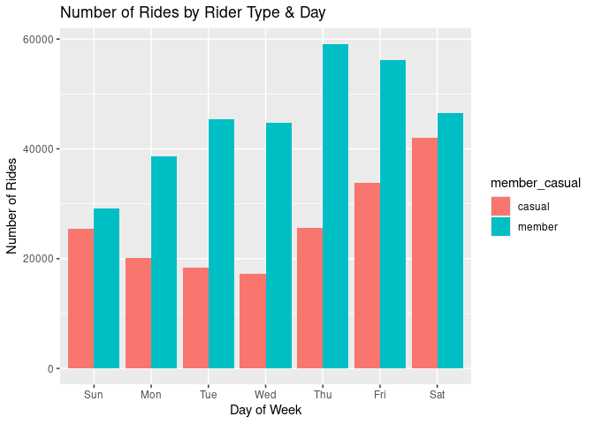
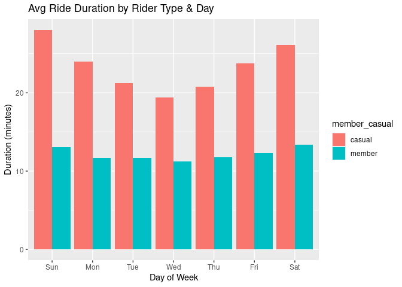

Cyclistic Bike-Share Case Study
================
Imran ul Haque Qureshi

# Business Task

- **Goal**: Help Cyclistic convert **casual riders** into **annual
  members**
- Compare behavior between casual vs. member riders
- Use insights to propose targeted marketing strategies

------------------------------------------------------------------------

# About Cyclistic

- Chicago-based bike-share company  
- 5,800+ bikes, 600+ stations
- Types: standard, reclining, hand tricycles, cargo bikes
- Plans: single-ride, day-pass, annual membership
- 30% of riders commute, rest ride for leisure

------------------------------------------------------------------------

# Key Stakeholders

- **Lily Moreno**: Director of Marketing
- **Marketing Analytics Team**
- **Cyclistic Executives** (decision-makers)

------------------------------------------------------------------------

# Tools & Data

- Tool: **RStudio + tidyverse + ggplot**
- Source: Divvy Trip Data (May 2022 – April 2023)
- Public dataset licensed by Motivate International
- 12 CSVs merged into 1 dataset

------------------------------------------------------------------------

# Cleaning & Preparation

- Removed empty columns, NA values, duplicates
- Calculated `ride_length` (in minutes)
- Created `day_of_week` using `wday()` from lubridate
- Removed rows with negative ride lengths
- Verified consistency across all months

------------------------------------------------------------------------

# Summary Statistics

    ## # A tibble: 2 × 5
    ##   member_casual avg_ride median_ride max_ride number_of_rides
    ##   <chr>            <dbl>       <dbl>    <dbl>           <int>
    ## 1 casual            23.8        11.8     1500          182637
    ## 2 member            12.1         8.6     1500          319819

<!-- --><!-- -->

# Key Insights

- Casual riders take longer rides, especially on weekends
- Members take shorter, more frequent rides, mostly on weekdays
- Suggests: casual = leisure, members = commuters

------------------------------------------------------------------------

# Recommendations

- 🎯 Weekend Promotions Offer discounts on annual plans to weekend
  riders

- 📱 Targeted Digital Ads Use ride history to promote commuting benefits

- 🎁 Membership Perks Free helmet rental, exclusive bikes, or partner
  rewards

# Conclusion

- Clear differences in how each rider type uses bikes

- Data supports marketing segmentation

- Digital outreach + perks can drive membership conversion

# Thank You! 🙌

Created in RStudio using Tidyverse + Ggplot

Data: Divvy Bike Share (2022–2023)

Analysis by: Imran Qureshi
